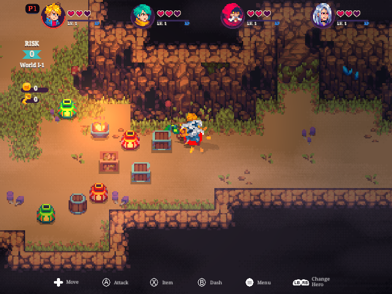
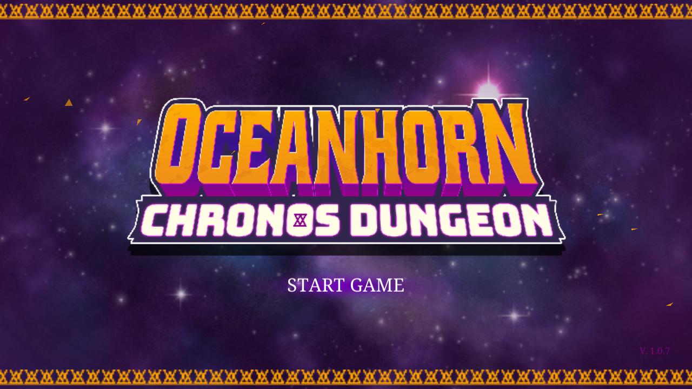
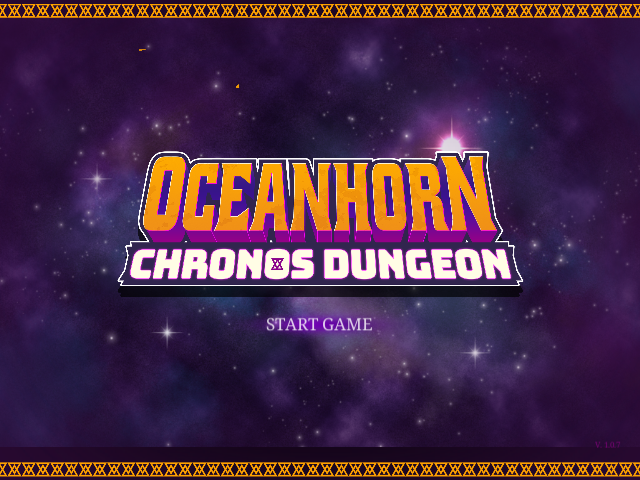
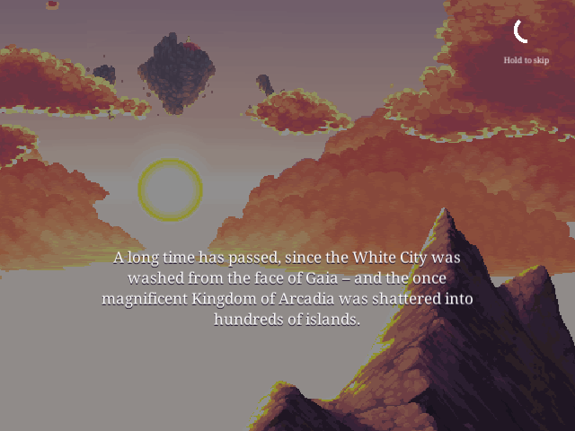

# Oceanhorn: Chronos Dungeon 4.0b54 — port universal AArch64 (framework v2)

**Language / Idioma:** [English](#english) · [Português](#português)

## English

Native AArch64 port of **Oceanhorn: Chronos Dungeon 4.0b54** for Linux handhelds.
It drives the original Android Unity 2022.3.61f1 IL2CPP libraries through a
native so-loader and keeps the Android lifecycle order intact. **No game data is
distributed here** — you bring your own legal copy (see `INSTALLATION.md`).

A single public runtime requires only **GLIBC_2.27**, so the same binary serves
every AArch64 firmware we can reach. Video, audio, memory profile and controls
are negotiated at runtime from real capabilities: no SDL backend, resolution or
device name is ever hardcoded.

**2.0.0** rebuilds the port on the NextOS **framework v2** (nxbootstrap 0.6.30
launcher, NXExtract 1.2.18, nxgl 0.2.14 frame proof, nxrelease 0.2.30): a single
generated launcher replaces the old `run.sh`, and performance profiles target
the ~1 GB devices.

Status: **PLAYABLE** (heritage of v1.0.x, physically validated on two very
different targets; 2.0.0 revalidation in progress):

| Aparelho | Vídeo | Resultado |
|---|---|---|
| **R36S / ArkOS** (RK3326, Mali-G31) | KMSDRM, ES3.0, 640×480 | título, cutscene e dungeon jogável, áudio, controle, `SELECT+START`; pico de 352 MB de RSS |
| **NextOS Elite** (Amlogic-old, Mali-450) | fbdev, GLES2, 1280×720 | mesmo binário universal, sem regressão |

Outros CFWs AArch64 (muOS, ROCKNIX, Batocera, Knulli e afins) são atendidos por
detecção de capacidade, mas ainda **não** têm prova física — não os declaramos
validados até alguém rodar.

## Performance profiles / Perfis de desempenho (2.0.0)

Edit `ports/oceanhorn/port-env.sh` (or export the variable) to pick one:

| `OCEANHORN_PROFILE` | What it does |
|---|---|
| `auto` (default) | `low` on ~1 GB devices, `high` elsewhere |
| `low` | renders at half resolution with **pixel-perfect integer upscale** (`CUP_RENDERSCALE=2`, NEAREST), big atlases as RGBA4444 (`CUP_TEX16`), texture cap 512 (`CUP_TEXHALF`) — this is the anti-lag profile for 1 GB |
| `medium` | native resolution, texture cap 768 |
| `high` | everything native |

Any individual `CUP_*` variable exported in the environment (or set in
`userdata/ocean-env.sh`, which updates never overwrite) wins over the profile.
`CUP_RS_FILTER=linear` restores the smooth upscale filter if you prefer it.
The Mali-450 GPU performance pin (all pixel processors at the top official
level, with a thermal guard) now lives inside the binary and restores the
original governor values on exit; `OCEAN_GPU_PERFORMANCE=0` disables it.


## Comunidade / Community

Dúvidas, relatos de bug, ajuda pra rodar o port e novidades dos próximos:

💬 **Discord:** [discord.gg/DHfY62eDNN](https://discord.gg/DHfY62eDNN)

### Capturas

| R36S / ArkOS (640×480) | NextOS Elite / Mali-450 (1280×720) |
|---|---|
|  |  |

| Título | Abertura |
|---|---|
|  |  |

### Architecture

The loader reproduces the native Android sequence instead of replacing it:

1. Map and relocate the original `libunity.so`.
2. Run its constructors and `JNI_OnLoad`.
3. Map `libil2cpp.so` and expose the original IL2CPP metadata and resources.
4. Register and call the UnityPlayer JNI entry points in their native order.
5. Create the real EGL/fbdev GLES context and deliver surface, resume and focus.
6. Run `nativeRender` while pumping Java callbacks, FMOD and controller input.
7. On exit, deliver focus loss and pause, flush preferences, stop audio and
   leave through the loader's teardown-safe path.

### Main fixes

| Area | Problem | Solution |
|---|---|---|
| Boot | Unity proxy handles crashed in `JNIBridge.invoke` | Keep ReflectionHelper GC handles and native JNIBridge pointers on their correct, separate paths |
| Data | Android APK/files paths do not exist on NextOS | Redirect Unity and IL2CPP reads to the original `bin/Data` tree |
| Rendering | Mali-450 is GLES2-only and some external-alpha sprites disappeared | Preserve the authored GLES2 variants and sample alpha from the decoded main texture |
| Display | Phase-1 render scaling damaged framing (wrong panel size) and blurred the pixel art (linear filter), and never presented on KMSDRM | 2.0.0: scale FBO sized from the real panel, pixel-perfect NEAREST integer upscale, presented on both fbdev and KMSDRM paths; enabled by the `low` profile |
| Audio | FMOD asynchronous Android streams ended in `ERR_INTERNAL` | Open the original FSB data synchronously as resident samples before the Android worker fails |
| Audio output | Android OpenSL ES is unavailable | Bridge OpenSL ES to SDL/PulseAudio, with soft limiting and a validated 1.5× output gain |
| Controller | Rewired accepted Android events but did not bind left-stick movement | Publish the real Android InputDevice ranges and mirror the left stick to the working d-pad KeyEvent path, with dead zone and hysteresis |
| Exit | No standard handheld exit chord | `SELECT+START` leaves the render loop, pauses Unity, flushes saves and returns to the frontend |
| Performance | Mali scaling kept only part of the GPU active at 400 MHz | Use all three pixel processors at the official 666 MHz level, add tile-buffer discard and cap the native cadence at 30 FPS |
| Thermals | Maximum GPU level should not remain forced above safe temperature | Drop one frequency level at 82 °C, restore it below 76 °C and restore the original governor values on exit |

### Controls

| Control | Action |
|---|---|
| Left stick / D-pad | Move |
| A | Attack / confirm |
| B | Dash / cancel |
| X | Item |
| L1 / R1 | Change hero |
| Start | Menu / pause |
| Select + Start | Save-safe exit to EmulationStation |

The current bridge publishes the first SDL game controller. Local multiplayer
with additional controllers has not been validated for this release.

### Game data

Game libraries and assets are proprietary and are not stored in the source
repository. A runtime installation contains:

```text
/storage/roms/ports/oceanhorn/
├── oceanhorn
├── run.sh
├── libunity.so
├── libil2cpp.so
├── libmain.so
├── bin/Data/
└── userdata/
```

The release package contains the exact required Unity data tree and an empty
`userdata` directory. It does not contain development logs, personal saves,
diagnostic captures, old binaries or the redundant source APK.

### Build and run

```sh
cd ports/oceanhorn
./build.sh
```

`build.sh` automatically selects the current NextOS Elite Amlogic-old AArch64
toolchain/sysroot. The release build was produced against the current glibc
2.43 sysroot; its highest referenced symbol is informational and may be lower.

Normal frontend entry:

```sh
/storage/roms/ports_scripts/Oceanhorn\ Chronos\ Dungeon\ \(NextOS\ Elite\).sh
```

Direct engineering run:

```sh
cd /storage/roms/ports/oceanhorn
./run.sh
```

### Runtime options

| Variable | Effect |
|---|---|
| `OCEAN_FRAME_LIMIT` | Frame cadence; production default is 30 |
| `HC_AUDIO_GAIN` | Output makeup gain; production default is 1.5 |
| `OCEAN_GPU_PERFORMANCE=0` | Disable the NextOS GPU performance profile |
| `OCEAN_GPU_THERMAL_HIGH` | GPU fallback threshold in millidegrees Celsius |
| `OCEAN_GPU_THERMAL_LOW` | GPU restore threshold in millidegrees Celsius |
| `OCEAN_INPUTLOG=1` | Diagnostic controller event log |
| `OCEAN_LOWMEM_KB` | `MemAvailable` threshold that triggers the Android low-memory signal (default 120000) |
| `OCEAN_TRUE_MEMINFO=1` | Let the engine see the device's real free memory instead of a fixed value (opt-in) |
| `OCEAN_RESIDENT_MAX_MB` | Ceiling for the FMOD stream→resident fallback (default 16) |

Put any of these in `ports/oceanhorn/userdata/ocean-env.sh` (one `export` per
line). That file survives port updates and is never shipped, so trying a knob
never means editing a distributed file:

```sh
# ports/oceanhorn/userdata/ocean-env.sh
export OCEAN_TRUE_MEMINFO=1
```

`CUP_RENDERSCALE` is deliberately removed by the production launcher because
scaled rendering was visually rejected on the target hardware.

### Source map

- `src/main.c` — ELF loader integration, Android lifecycle, Unity/FMOD hooks,
  data redirects, render loop and safe shutdown.
- `src/jni_shim.c` — fake Java/JNI environment, InputDevice publication,
  SharedPreferences persistence and callbacks.
- `src/ocean_input.c` — SDL controller to Android KeyEvent/MotionEvent bridge,
  left-stick movement and `SELECT+START`.
- `src/opensles_shim.c` — OpenSL ES to SDL/PulseAudio bridge and output gain.
- `src/egl_shim.c`, `src/renderscale.c` — EGL/GLES routing and texture handling;
  render scaling remains disabled in production.
- `src/sem_shim.c`, `src/pthread_fake.c` — Android/bionic synchronization
  compatibility on glibc.
- `src/so_util.c` — AArch64 Android ELF mapping and relocation.
- `run.sh` — one-instance guard, runtime environment, GPU profile and thermal
  restoration.

### License

The loader and launcher are GPL-3.0. Original game libraries and assets remain
proprietary and are not covered by that license. See `LICENSE` and the runtime
notice included with private full-data releases.

## Português

Port nativo AArch64 de **Oceanhorn: Chronos Dungeon 4.0b54** para aparelhos
NextOS Elite com Amlogic Mali-450 (Utgard, GLES2). O so-loader dirige as
bibliotecas Android originais do Unity 2022.3.61f1 IL2CPP e preserva a ordem do
ciclo de vida nativo.

Estado: **JOGÁVEL**. Foram validados gameplay, tela completa em 1280×720, áudio,
save persistente, controle físico, movimento pelo analógico esquerdo e saída
limpa. O gameplay medido fica normalmente em 25–30 FPS sem reduzir o
framebuffer nem alterar os gráficos originais.

### Como funciona

O loader reproduz o fluxo Android em vez de atalhá-lo:

1. Mapeia e reloca a `libunity.so` original.
2. Executa construtores e `JNI_OnLoad`.
3. Mapeia a `libil2cpp.so` e expõe metadata e resources originais.
4. Registra e chama os pontos JNI do UnityPlayer na ordem nativa.
5. Cria EGL/fbdev GLES real e entrega superfície, resume e foco.
6. Executa `nativeRender` bombeando callbacks Java, FMOD e controle.
7. Na saída, remove foco, pausa a Unity, persiste preferências, para o áudio e
   usa o caminho seguro de encerramento do so-loader.

### Correções principais

| Área | Problema | Solução |
|---|---|---|
| Boot | Handles de proxy do Unity quebravam em `JNIBridge.invoke` | Separação correta entre GCHandle da ReflectionHelper e ponteiro nativo do JNIBridge |
| Dados | Caminhos Android de APK/files não existem no NextOS | Redirecionamento para a árvore original `bin/Data` |
| Render | Mali-450 só oferece GLES2 e sprites de alpha externo sumiam | Variantes GLES2 originais preservadas e alpha lido da textura principal decodificada |
| Imagem | Render-scale experimental estragava enquadramento e qualidade | Framebuffer nativo obrigatório; produção nunca ativa render-scale |
| Áudio | Streams assíncronos do FMOD terminavam em `ERR_INTERNAL` | FSB original aberto de forma síncrona e residente antes da falha do worker Android |
| Saída sonora | OpenSL ES Android não existe no sistema | Bridge OpenSL ES para SDL/PulseAudio, limitador suave e ganho validado de 1,5× |
| Controle | Rewired aceitava eventos, mas não associava movimento ao analógico | InputDevice Android completo e analógico esquerdo espelhado no caminho funcional do direcional, com zona morta e histerese |
| Saída | Faltava o combo padrão de handheld | `SELECT+START` sai do loop, pausa a Unity, grava o save e volta ao frontend |
| Performance | O scaler do Mali mantinha parte da GPU em apenas 400 MHz | Três pixel processors no nível oficial de 666 MHz, descarte de tile buffer e cadência nativa limitada a 30 FPS |
| Temperatura | O nível máximo não deve ficar forçado acima da faixa segura | Recua um nível a 82 °C, volta abaixo de 76 °C e restaura o governor original ao sair |

### Controles

| Controle | Ação |
|---|---|
| Analógico esquerdo / Direcional | Mover |
| A | Atacar / confirmar |
| B | Dash / cancelar |
| X | Item |
| L1 / R1 | Trocar herói |
| Start | Menu / pausa |
| Select + Start | Saída com persistência para o EmulationStation |

O bridge atual publica o primeiro controle SDL. Multiplayer local com controles
adicionais ainda não foi validado nesta entrega.

### Dados e instalação

As bibliotecas e os assets do jogo são proprietários e não ficam no repositório
de código. O pacote privado full-data inclui a árvore Unity necessária, as três
bibliotecas ARM64, loader, launcher, licença, aviso, imagem do frontend e
`userdata` vazio. Não inclui APK redundante, logs, saves pessoais, capturas,
backups, fontes ou binários antigos.

O port é BYO-data: o APK que você traz pode não ser exatamente a build de onde
os endereços internos foram extraídos. O log abre com uma linha `[BUILD]` que
diz se a sua cópia casa com a build de referência, e todo patch interno confere
a assinatura do código antes de escrever — numa build diferente o patch se
desliga sozinho em vez de corromper função desconhecida.

Ajustes de testador vão em `ports/oceanhorn/userdata/ocean-env.sh` (um `export`
por linha); esse arquivo sobrevive à atualização do port. Ver a tabela de
opções na seção em inglês.

### Compilar e executar

```sh
cd ports/oceanhorn
./build.sh
```

O script escolhe automaticamente o toolchain/sysroot AArch64 da versão atual do
NextOS Elite. O build desta entrega usa o sysroot glibc 2.43 atual.

Entrada normal pelo frontend:

```sh
/storage/roms/ports_scripts/Oceanhorn\ Chronos\ Dungeon\ \(NextOS\ Elite\).sh
```

Execução direta de engenharia:

```sh
cd /storage/roms/ports/oceanhorn
./run.sh
```

### Licença

Loader e launcher são GPL-3.0. As bibliotecas e os assets originais do jogo
continuam proprietários e não são cobertos por essa licença. Consulte `LICENSE`
e o aviso incluído na entrega privada full-data.
